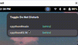
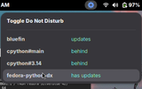
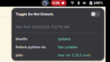

# upd-indicator
GNOME extension that provides indication that updates are available

> [!IMPORTANT]
>
> What I am providing in this repo is a sample implementation of some ideas.
>
> You should not think of this repo as code that you can clone and use as is. Your requirements are going to be different than mine. Be prepared to heavily modify or even rewrite what is here.
>
> The files herein are simply a sample implementation of the ideas presented below.

## Background

Some indication of when various updates need our attention would be useful. And not just for OS updates, but various maintenance activities whether related to the local system or not.

If a command line can be crafted to provide an indication of when an update is available, that should be all that is needed - right?

Yes it is.

Have a favorite web service you monitor? `curl` it!

Tracking a channel on YouTube? If you can write a script to recognize new videos - do it!

Have some custom `systemd` units for maintenance? Just add an `echo` of [well-defined JSON](./docs/architecture-desgn.md#passing-json-out-of-rule-monitoring-command-scripts) to a file at a location YOU choose.

That should be all you need to define a monitoring rule that will cause an indicator to show when there is something that needs your attention.

## Installing the Extension

_See [upd-indicator@for-many](./upd-indicator@for-many/README.md) for details._

## Running the Python program to monitor for updates

It is written in Python and uses `Gio.Settings` to retrieve the extensions prefs.

_See [upd_monitor](./upd_monitor/README.md) for details._

And, after install, it is scheduled with [systemd](./systemd/README.md).

## Approach

GNOME extensions are written with GJS - where GJS ironically stands for [JavaScript for GNOME](https://gjs.guide/).

_Also see [docs/](./docs/README.md) for details._

## Status

- 2025-05-29 I have just created this repo and put up a call to action at [Bluefin - flexible update indicator project](https://universal-blue.discourse.group/t/bluefin-flexible-update-indicator-project/8844).
- 2025-05-30 Got a rough draft of the status bar UI completed and captured a demo amimated gif. See above.
- 2025-06-05 The summary display is working; although notification is _possible_ it is not clear how to do that. It is disabled for now.
- 2025-06-06 Added devcontainer definition - cannot perform `pnpm run nested` in the devcontainer - run it on the host instead !
- 2025-06-07 Added pollingRuleAdapter, CompositeRuleAdapter class and demos - completed phase 1 ! Started phase 2 design
- 2025-06-12 Added upd_indicator Python program to monitor CLI commands and place json files in `monitor-location`; revised `upd-indicator` extension to poll that dir for `json` files. _See [#22](https://github.com/klmcwhirter/upd-indicator/issues/22)_
- 2025-06-13 Renamed upd_indicator to upd_monitor; added reference systemd units to orchestrate its invocation
- 2025-06-15 Enhanced local install feature; added settings import from [`settings.json`](./examples/settings.json) file; change settings schema to store path to the installed [`rules.json`](./examples/rules.json)
- 2025-06-21 Added exec verb to upd_monitor to allow executing a rule
- 2025-06-22 Added phase 2 demo - phase 2 is complete; upd-indicator is now in maintenance mode

## Demos / Examples

|Link|Description|
| --- | --- |
||Early demo during phase 1 with dummy data|
||shows rule definitions, the steps I take to resolve each item and shows each dropping off the list as they are updated|
||shows the current state of upd-indicator as of phase 2 completion and shows rule detection / resolution|
|[`rules.json`](./examples/rules.json)|example rule.json file|
|[`settings.json`](./examples/settings.json)|example settings.json file|
|[`upd-indicator-monitor.service`](./systemd/upd-indicator-monitor.service)|sample upd-indicator-monitor.service systemd unit|
|[`upd-indicator-monitor.timer`](./systemd/upd-indicator-monitor.timer)|sample upd-indicator-monitor.timer systemd unit|
|[`etc/scripts/`](./etc/scripts/)|this is where scripts (associated with your rules) are placed so they get installed|

## Reference
- https://gjs.guide/
- https://gjs.guide/guides/gio/subprocesses.html
- https://gjs.guide/guides/gjs/asynchronous-programming.html
- https://gjs-docs.gnome.org/
- https://pygobject.gnome.org/getting_started.html#fedora-logo-fedora
