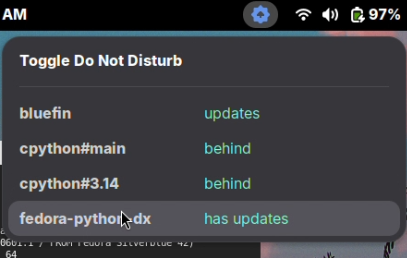

# Phase 1 Demo - Example Rules and Resolution Session

In this clip I used some rules to detect a few things in which I am interested.



In the list of updates are the bluefin OS, branches of my cpython fork and my fedora-python-dx distrobox. All need some attention.

The clip shows the rule definitions, the steps I take to resolve each item and shows each dropping off the list as they are updated.

> Please note that the items drop from the list so quickly because I have the monitorRate set to 15 secs during development.
> Something like 1-2 hr monitorRate is probably more reasonable.

See below for links to the individual artifacts.


## Artifacts

- [Rules](rules.json) - the extensions prefs screen will have an import / export feature

#### Scripts

_Note that `jq` is used to validate the json. It is installed with `brew`. This is an incredibly helpful technique while writing rule scripts!_

```
# note no quotes surrounding name - a common mistake
echo '[{ name: "malformed json","status":"updates" }]' | jq -cM .

# which will result in something like this:
jq: parse error: Invalid numeric literal at line 1, column 8

# once it is fixed ...
echo '[{ "name": "well formed json","status":"updates" }]' | jq -cM .
[{"name":"well formed json","status":"updates"}]
```

- [rpm-ostree-update-check.sh](rpm-ostree-update-check.sh)
- [cpython-clone-behind.sh](cpython-clone-behind.sh)
- [fedora-python-dx-has-updates.sh](fedora-python-dx-has-updates.sh)
